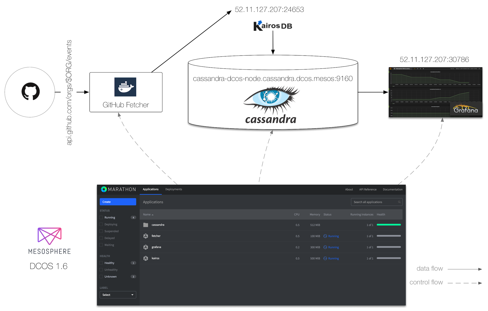
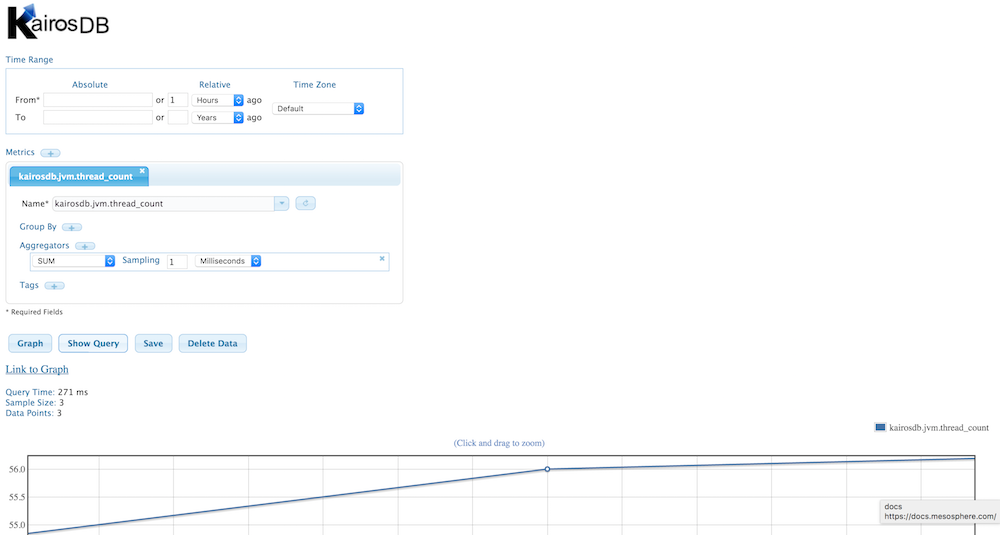
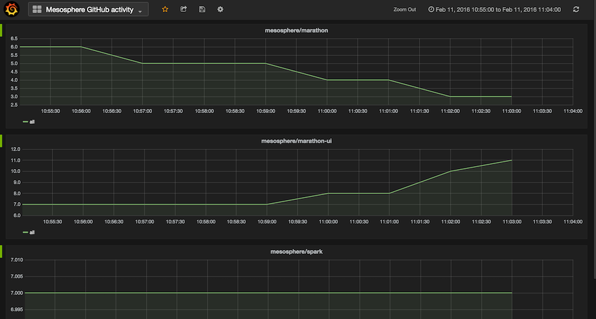

# DCOS KairosDB Tutorial

In this tutorial you'll learn how to set up the time series database [KairosDB](http://kairosdb.github.io/)
along with the popular NoSQL database [Cassandra](http://cassandra.apache.org/) on [DCOS](https://mesosphere.com/product/).
We will use the [GitHub API](https://developer.github.com/v3/) as a stream datasource and build a dashboard
using [Grafana](http://grafana.org/).

The overall application architecture looks as follows: 

Note with exemplary ports shown, this part varies based on the actual deployment

## Preparation 

- Create a [DCOS cluster](https://mesosphere.com/product/)
- Install [Cassandra](https://docs.mesosphere.com/manage-service/cassandra/)

## Deployment

Using Docker images with Marathon we will deploy KairosDB and Grafana, yielding:

### Launching KairosDB 

Use the DCOS command line interface to launch the [Marathon app spec for KairosDB](marathon-kairosdb.json): 

    $ dcos marathon app add marathon-kairosdb.json

Note: on the KairosDB internal port 8080 both the Web UI and also the HTTP interface are exposed (look up mapped port in Marathon).

Cassandra cassandra-dcos-node.cassandra.dcos.mesos 9160

### Launching Grafana and connecting to KairosDB

Grafana supports KairosDB as a backend since [v2.1](http://docs.grafana.org/v2.6/datasources/kairosdb/).
Again, use the DCOS command line interface to launch the [Marathon app spec for KairosDB](marathon-grafana.json): 

    $ dcos marathon app add marathon-grafana.json

http://52.11.127.207:30786/

### Getting data from GitHub

https://api.github.com/orgs/$ORG/events